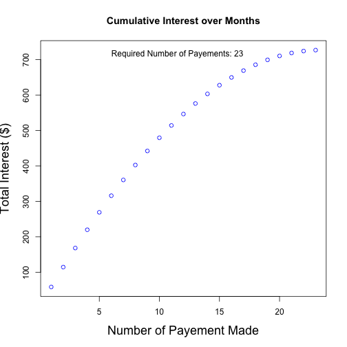

## Motivation

When we receive our monthly credit card statement, there’s a temptation to pay only the minimum amount. By doing so, we can lose hundreds, sometimes thousands of dollars in interest to credit card companies.  This can easily be avoided by executing a more thoughtful payment plan.

The free and easy-to-use Interest Calculator app can help you gain insight into your optimal monthly payment plan.  In this short presentation, we will demonstrate how this app can help you find the optimum credit card payment plan.


--- .class #id 

## The Interest Calculator App


You can run this application for free on any web browser. Simply provide the Interest Calculator App with your credit card balance, the credit card annual percentage rate (APR), and your anticipated monthly payment.

The application will calculate the number of payments you will need to make and the total interest amount that you have to pay. It also shows the cumulative interest for each month so you can get an picture of true cost of that payment plan.

Furthermore, the application alerts you if your payment amount is too low to be able to pay off your account balance. Subsequently, it will calculate the minimum payment you need to make. Feel free to try making $1 monthly payments!

--- .class #id 


## The Interest Calculator App Main Code


```r
total.interest <- function(balance,APR,pay) 
{interest <- 0; interests <- c()
  apr.monthly <- (APR / 12) * 0.01
  while (balance > 0) {
    interest <- balance*apr.monthly + interest
    interests <- append(interests,interest)
    balance <- balance + balance*apr.monthly - pay}
interests
}

paste('Total Interest: $',
round(max(total.interest(balance=5000,APR=14,pay=250)),2))
```

```
## [1] "Total Interest: $ 726.91"
```

--- .class #id 

## The Interest Calculator App Demonstration


```r
interest <- total.interest(balance=5000,APR=14,pay=250)
plot(interest,ylab='Total Interest ($)',xlab='Number of Payement Made', 
main = 'Cumulative Interest over Months' , col='blue',cex.lab=1.5)
text(length(interest)/2,max(interest),adj = c(.5,1), 
paste('Required Number of Payements:',length(interest)))
```




